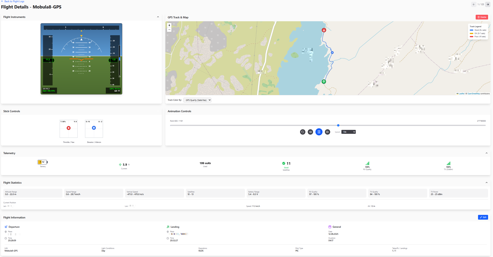
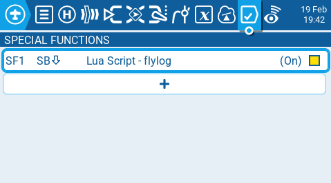
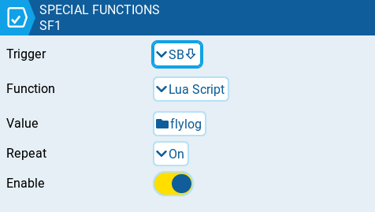
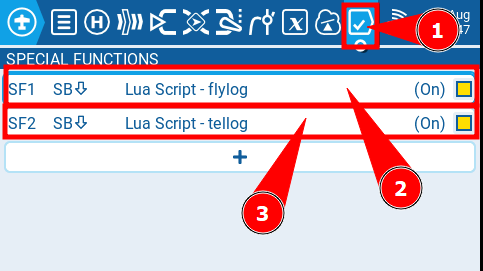
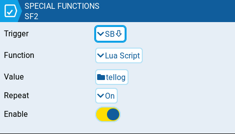
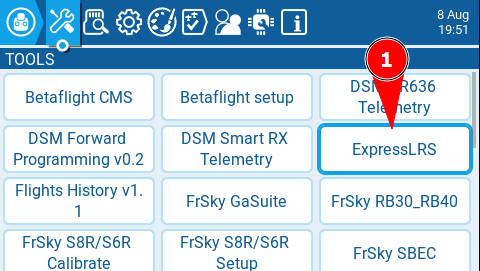
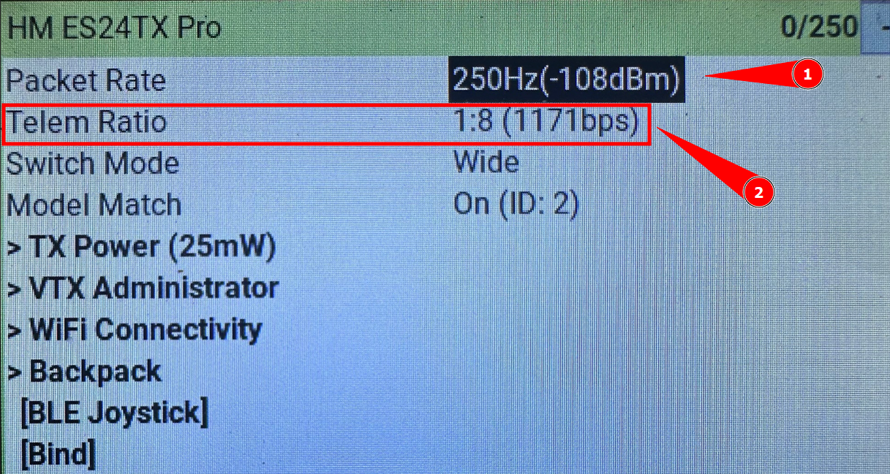

# FlyLog & TeleLog - Logging Scripts for EdgeTX

This repository contains two Lua scripts for EdgeTX transmitters:

- **flylog.lua**: Logs arming/disarming events, timestamps, GPS coordinates, and model name.
- **tellog.lua**: Logs detailed telemetry data at regular intervals during flight.

## UAV Manager

These log files can be managed and analyzed with the [UAV Manager](https://github.com/CarviFPV/UAV_Manager).



## Features

### flylog.lua

- Logs arming and disarming events
- Records date, time, GPS coordinates, and model name
- Creates a CSV log file (`/LOGS/flylog.csv`) if it doesn't exist
- Easy setup using the EdgeTX "Special Functions" menu

### tellog.lua

- Logs detailed telemetry data at regular intervals (about every 0.43 seconds, i.e., 3.5 times per second by default; this interval can be changed in the script)
- Records GPS, altitude, speed, heading, pitch, roll, yaw, battery, current, capacity, quality, stick positions, and more
- Creates a CSV log file per flight in `/LOGS/`, named with the model and timestamp
- Useful for post-flight analysis and visualization

## Installation

### flylog.lua

1. **Download/Obtain the Script**  
   Save the `flylog.lua` file into the `SCRIPTS/FUNCTIONS` directory on your EdgeTX SD card.

2. **Configure the Script in EdgeTX**

   1. On your EdgeTX transmitter, open the **Model** page and navigate to the **Special Functions** tab.
   2. Create a new special function (tap the `+` icon).
      
   3. Under **Trigger**, select the switch you want to use to start/stop logging (e.g., your arming switch).
   4. Under **Function**, choose **Lua Script**.
   5. Under **Value**, select `flylog.lua`.
   6. Set **Repeat** to **ON**.
   7. Make sure **Enable** is toggled on.

      

   Refer to the provided screenshots for an example of how this is set up.

### tellog.lua

1. **Download/Obtain the Script**  
   Save the `tellog.lua` file into the `SCRIPTS/FUNCTIONS` directory on your EdgeTX SD card.

2. **Configure the Script in EdgeTX**  
   The setup is the same as for `flylog.lua`:

   1. On your EdgeTX transmitter, open the **Model** page and navigate to the **Special Functions** tab.
   2. Create a new special function (tap the `+` icon).
      
      
      
      1 special functions
      
      2 flylog.lua script
      
      3 tellog.lua script

   3. Under **Trigger**, select the switch you want to use to start/stop logging (e.g., your arming switch).
   4. Under **Function**, choose **Lua Script**.
   5. Under **Value**, select `tellog.lua`.
   6. Set **Repeat** to **ON**.
   7. Make sure **Enable** is toggled on.

      

   Refer to the provided screenshots for an example of how this is set up.

### ExpressLRS Settings

   A. Click on SYS and go to the Tools tab.
   B. There you should see the ExpressLRS script.
      
   
   
   C. Then you should set the following:
      
    
      
   1. Packet Ratio      = 250HZ
      
   2. Telemetry Ratio   = 8
      
      **Note:** The default Packet Ratio of 250Hz is fine, but the standard Telemetry Ratio is too high and should be set to 8. If you use a different Packet Ratio, you will need to find the best Telemetry Ratio for your setup, as it always depends on the Packet Ratio. If the Telemetry Ratio is too high, you will get less data, which can make the telemetry look messy in the UAV Manager when analyzing your flight data.


## Usage

### flylog.lua

- **Arming**: When you toggle your chosen switch from the disarmed state to the armed state, the script will log the "Arming" event, along with the current date/time, and the GPS coordinates at arming.
- **Disarming**: When you toggle the switch back to disarmed, the script logs the "Disarming" event, along with the disarming date/time, GPS coordinates, and the total duration (in seconds) of the armed flight.

After each flight, a new line will be added to the `flylog.csv` file in your transmitter’s `LOGS` folder.

### tellog.lua

- When active, the script creates a new CSV file in `/LOGS/` for each session, named like `<ModelName>_TeleLog_<YYYYMMDD>_<HHMMSS>.csv`.
- About every 0.43 seconds (every 15 ticks, see the `if gpsTrackFile and now - lastLogTick >= 15 then` line in the script to adjust this interval), it logs a row with the current telemetry values.
- Stop the script or power off to close the log file.

## Log File Formats

### flylog.lua

The CSV file (`flylog.csv`) contains the following columns:

```
Arming,Date,Timestamp-TO,GPS-Arming-Lat,GPS-Arming-Lon,Disarming,Timestamp-LDG,GPS-Disarming-Lat,GPS-Disarming-Lon,Duration,ModelName
```

Each row corresponds to a single flight:

- **Arming**: A constant text field ("Arming").
- **Date**: The flight date in `YYYY-MM-DD` format.
- **Timestamp-TO**: The arming time (takeoff) in `HH:MM:SS` format.
- **GPS-Arming-Lat**: Latitude at the moment of arming.
- **GPS-Arming-Lon**: Longitude at the moment of arming.
- **Disarming**: A constant text field ("Disarming").
- **Timestamp-LDG**: The disarming time (landing) in `HH:MM:SS` format.
- **GPS-Disarming-Lat**: Latitude at the moment of disarming.
- **GPS-Disarming-Lon**: Longitude at the moment of disarming.
- **Duration**: The flight duration in seconds.
- **ModelName**: The name of the model used during the flight.

### tellog.lua

Each session creates a CSV file with columns:

```
time,GPS_numSat,GPS_coord[0],GPS_coord[1],GPS_altitude,GPS_speed,GPS_ground_course,VSpd,Pitch,Roll,Yaw,RxBt,Curr,Capa,RQly,TQly,TPWR,Ail,Ele,Thr,Rud
```

- **time**: Time since power-on (in 10ms units)
- **GPS_numSat**: Number of GPS satellites
- **GPS_coord[0]**: Latitude
- **GPS_coord[1]**: Longitude
- **GPS_altitude**: Altitude
- **GPS_speed**: Ground speed
- **GPS_ground_course**: Heading/course
- **VSpd**: Vertical speed
- **Pitch, Roll, Yaw**: Attitude angles
- **RxBt**: Receiver battery voltage
- **Curr**: Current (A)
- **Capa**: Consumed capacity (mAh)
- **RQly, TQly**: RF link quality
- **TPWR**: Transmit power
- **Ail, Ele, Thr, Rud**: Stick positions

#### Example Output

```
time,GPS_numSat,GPS_coord[0],GPS_coord[1],GPS_altitude,GPS_speed,GPS_ground_course,VSpd,Pitch,Roll,Yaw,RxBt,Curr,Capa,RQly,TQly,TPWR,Ail,Ele,Thr,Rud
821470000,14,47.1846924,8.6641636,0,0.40,235.5,-10.00,0.1,0.1,2.8,7.20,0.70,248,100,100,25,13.00,6.00,-1024.00,-6.00
821620000,14,47.1846924,8.6641636,0,0.40,235.5,-11.00,0.1,0.1,2.8,7.20,0.70,248,100,100,25,11.00,7.00,-1024.00,-9.00
... (more rows)
```

## License

This project is licensed under the **MIT License**.

## Notes

- Both scripts automatically create their log files if they do not exist.
- Ensure that your radio has logging enabled and sufficient storage for logs.
- The scripts use `getDateTime()` and telemetry fields to log accurate data.
